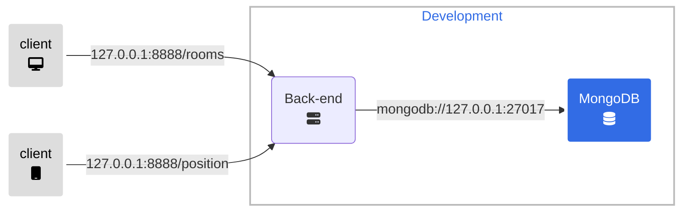
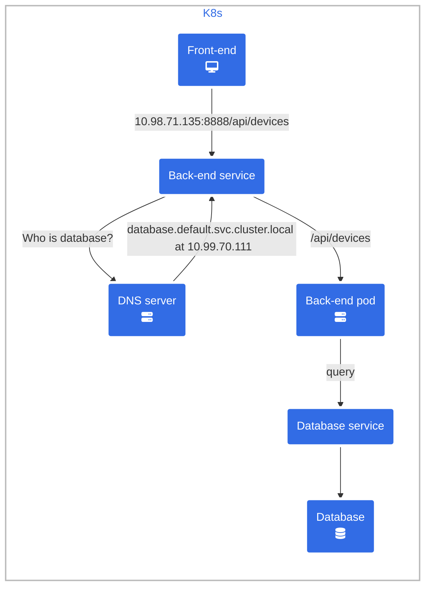

The back-end is built with Flask and Python, containerized using Docker. It relies on Gunicorn as a Web Server Gateway Interface (WSGI). WSGI is a standard that specifies a universal interface between web servers and web applications or frameworks. Gunicorn is a popular WSGI HTTP server that can run any WSGI-compliant Python web application. It is lightweight and efficient, with capabilities such as autonomous worker process management, load balancing, and reporting. Back-end offers APIs for room access management and indoor positioning estimation. Back-end communicates with a MongoDB instance to store and load data. Back-end has also two environments: development (or local) and production.

The development environment consists of two entities: the back-end Flask application and a MongoDB database running in a Docker container. The MongoDB Docker container can be bound to any port; however, the chosen port must be specified in the Flask application's configuration file in order to connect them.

## Development

## Production

The production environment refers to a K8s cluster. Like the front-end, the back-end has its own GitHub repository with a configured Continuous Integration method that generates a Docker image each time the main branch is updated.
