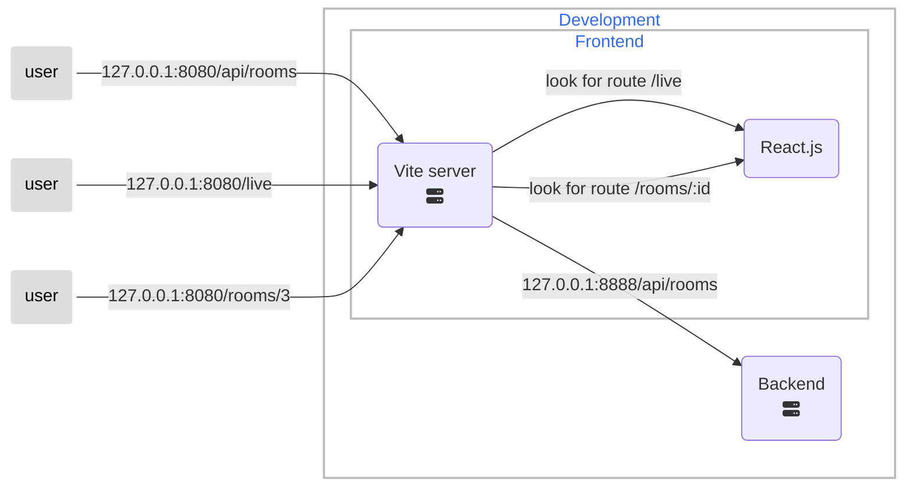
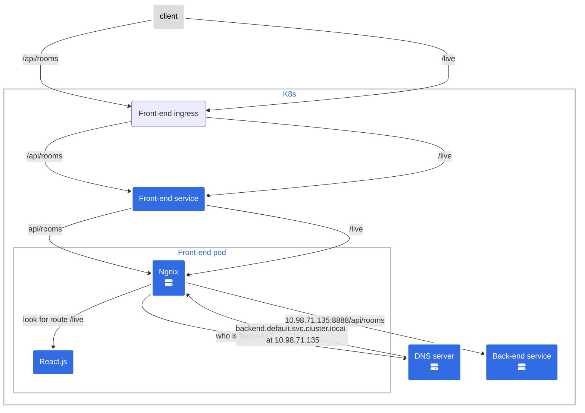

The front-end is built with Vite and React.js, containerized using Docker. Vite is a JavaScript build tool that provides a fast development experience by using a development server with hot module replacement (HMR) enabling instant reloading while developing. The front-end communicates with the back-end using application programming interfaces (APIs). Front-end provides a simple user interface for managing room access, it also offers live map of the user's approximate position inside the building and supports customized notifications settings. The front-end has two separate environments: development (or local) and production. The development environment is based on Vite's built-in proxy server, which routes requests beginning with /api to a static address defined in the environment configuration. The development environment has no distribution folder (there is no build-time), and the front-end is served by the Vite server.

## Development environment

## Production environment

The production environment refers to a K8s cluster. When the front-end is deployed in production, it is containerized, and Ngnix serves as both an HTTP server and a reverse proxy. The Docker image contains a build of the front-end that is loaded into Ngnix and begins serving. Ngnix routes all requests beginning with /api to the backend service in the K8s cluster. When a request starting with /api is intercepted the Ngnix server has to route the request to the backend discovering its address inside the cluster. In order to do that it asks to the Domain Name System (DNS) where is the backend service

The front-end project has its own repository on GitHub. To smoothly update the production environment, the front-end uses GitHub actions to generate a new docker image each time the repository's main branch is changed. The docker image may be pulled directly into K8s, delivering the most recent version of the software within the cluster (the pull policy defined for the front-end deployment is set to always pull the latest image from the container registry).
