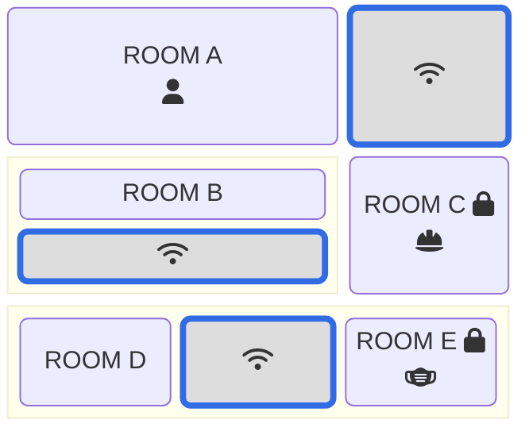

The mobile application represents is developed using Flutter and targets only Android devices, which is a result of Apple's strict guidelines on WiFi scanning from within an application sandbox.

[See also](positioning-api.md)

The mobile application periodically scan the surrounding environment looking for Bluetooth Low Energy (BLE) devices and WiFi access points. Then it sends localization request to the back-end providing WiFi APs information such as Service Set Identifier (SSID) and RSS for each AP, BLE devices information and the user identifier. The back-end predicts device's current position and updates user's last seen position in the database. If the user, carrying the smartphone, enters a place where they are not allowed, leaves a place where they are allowed but have forgotten to bring their protective device, or leaves a location where they are authorized but have forgotten to bring their protective device, the mobile application will eventually display notifications. Notification types can be customized from the front-end.

