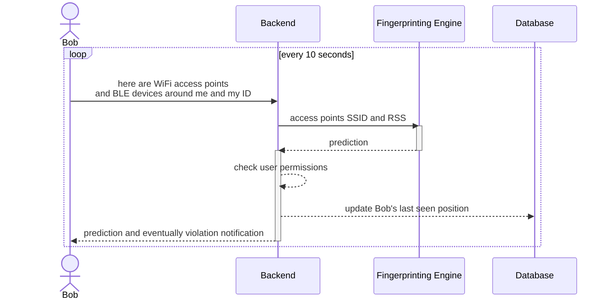

The project focuses on the position API, which is offered by the back-end to receive an estimation of the current position given a set of access points and their signal strength. This specific component project is based on one of my past efforts, Wifind.

Wifind is a Python module that includes a command line interface, provides WiFi fingerprinting, stores offline data, and trains a classifier to predict a position based on online data. This project does not use the Wifind package directly, but it does incorporate part of its logic to offer Received Signal Strength (RSS)-based localization.

The diagram illustrates a looped interaction between the back-end and clients. Occasionally, the back-end is required to generate a position estimate. In the diagram, the Fingerprinting Engine entity illustrates the modules required to get a pre-trained model file and provide a prediction. Once the prediction is generated, the back-end determines whether the user can enter the predicted room and, if not, warns them of any violations.

To offer this functionality the back-end provides an offline stage data retrieval service. APs and current room label provided by the client are stored and afterwards used to train a classifier. As demonstrated in Fig.\ref{position-api-sequence-offline}, any given client can provide AP information and current location label so that the back-end can update a classifier that will be used during the online stage. RSS of APs is translated from Decibel to a quality measure ranging from 0 to 100, with 0 indicating low quality and 100 indicating optimal quality. This is done to make classifier training easier by avoiding negative values.

An alternative to this approach would be using unsupervised learning algorithms, such as clustering algorithms. The challenge, then, would not be identifying the different rooms but rather defining access rules without being aware of what each cluster represents. \par Data used for training can be extracted using the provided API in order to analyze them and evaluate the overall system performances.
