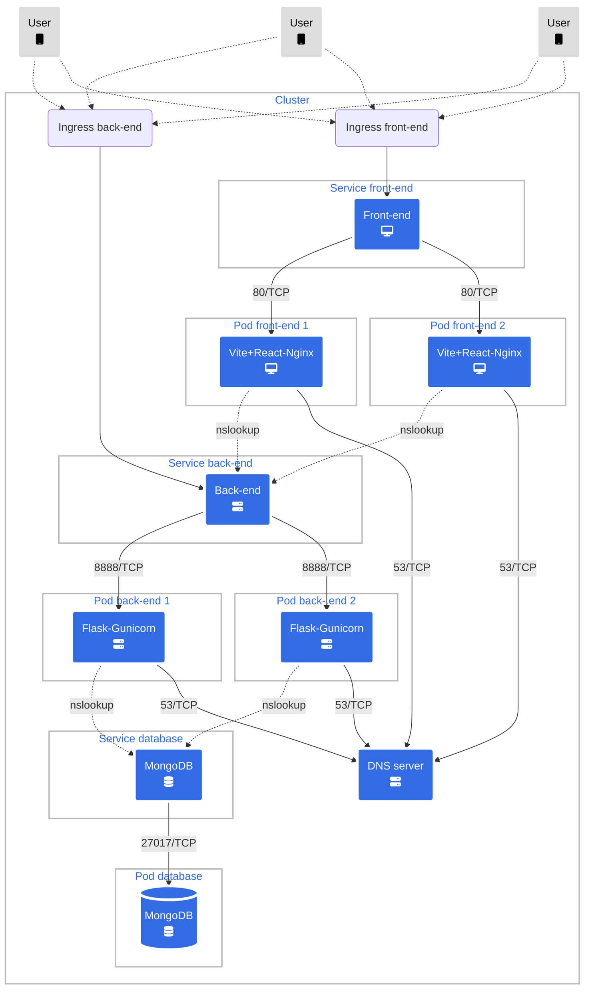

The system consists four components:

- Web application (front-end)
- Mobile application
- Server-side application (back-end)
- Database.

Except for the mobile application, all components are containerized with Docker and orchestrated by Kubernetes.

