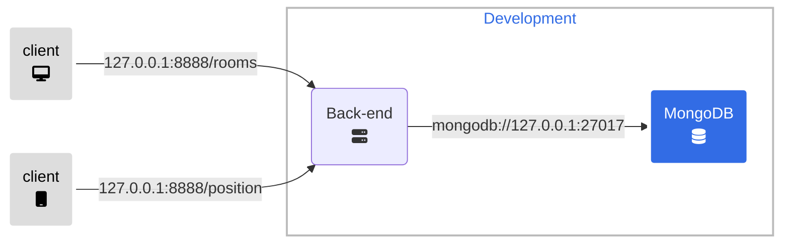

```mermaid
graph LR

    client1(client \n fa:fa-desktop)
    client2(client \n fa:fa-mobile)

    subgraph Development
        backend(Back-end \n fa:fa-server)
        database(MongoDB \n fa:fa-database)
    end

    client1 -- 127.0.0.1:8888/rooms --> backend
    client2 -- 127.0.0.1:8888/position --> backend
    backend -- mongodb://127.0.0.1:27017 --> database

   classDef plain fill:#ddd,stroke:#fff,stroke-width:4px,color:#000;
   classDef k8s fill:#326ce5,stroke:#fff,stroke-width:4px,color:#fff;
   classDef cluster fill:#fff,stroke:#bbb,stroke-width:2px,color:#326ce5;
   class database k8s;
   class Cluster cluster;
   class client1,client2 plain

```
