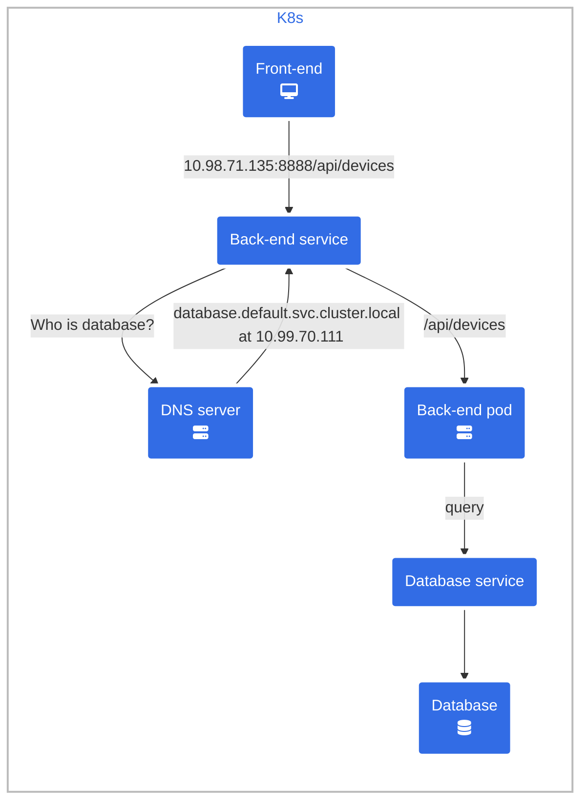

```mermaid
graph LR
    subgraph K8s
        class Cluster cluster;

        frontend(Front-end \n fa:fa-desktop)
        backend-service(Back-end service)
        database-service(Database service)
        dns(DNS server \n fa:fa-server)

        backend(Back-end pod \n fa:fa-server)
        database(Database \n fa:fa-database)
    end

    frontend -- 10.98.71.135:8888/api/devices --> backend-service
    backend-service -- Who is database? --> dns -- database.default.svc.cluster.local \n at 10.99.70.111 --> backend-service
    backend-service -- /api/devices --> backend -- query --> database-service --> database

    classDef plain fill:#ddd,stroke:#fff,stroke-width:4px,color:#000;
    classDef k8s fill:#326ce5,stroke:#fff,stroke-width:4px,color:#fff;
    classDef cluster fill:#fff,stroke:#bbb,stroke-width:2px,color:#326ce5;
    class frontend,backend-service,dns,backend,database-service,database k8s;
    class Cluster cluster;
    class user plain;
```
