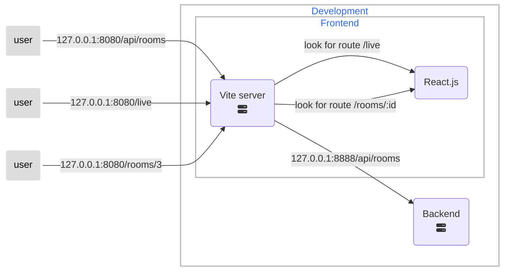

```mermaid
graph LR

    user1(user)
    user2(user)
    user3(user)

   subgraph Development
       class Cluster cluster;

        subgraph Frontend
            frontend(Vite server \n fa:fa-server)
            react(React.js)
        end
       backend(Backend \n fa:fa-server)
    end

    user1 -- 127.0.0.1:8080/api/rooms --> frontend -- 127.0.0.1:8888/api/rooms --> backend
    user2 -- 127.0.0.1:8080/live --> frontend -- look for route /live --> react
    user3 -- 127.0.0.1:8080/rooms/3 --> frontend -- look for route /rooms/:id  --> react

   classDef plain fill:#ddd,stroke:#fff,stroke-width:4px,color:#000;
   classDef k8s fill:#326ce5,stroke:#fff,stroke-width:4px,color:#fff;
   classDef cluster fill:#fff,stroke:#bbb,stroke-width:2px,color:#326ce5;
   class service-backend,service-frontend,service-database,pod-backend1,pod-backend2,pod-frontend1,pod-frontend2,pod-database,dns k8s;
   class Cluster cluster;
   class user1,user2,user3 plain

```
