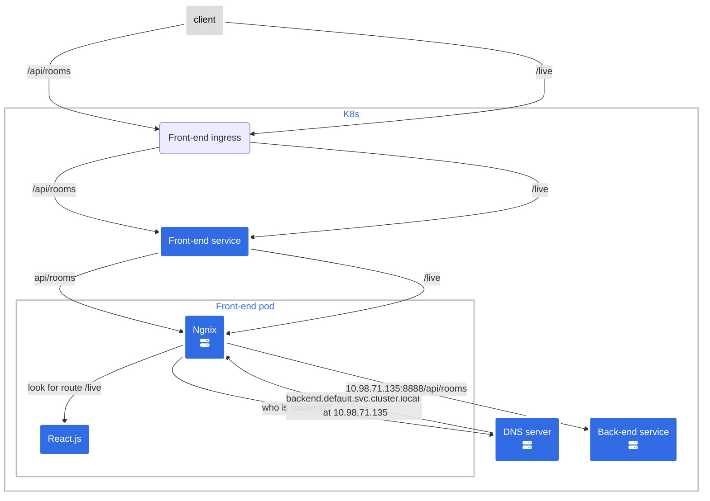

```mermaid
graph TD

    user1(client)
    %% user2(user)
    %% user3(user)

    subgraph K8s
        class Cluster cluster;

        subgraph FrontendPod[Front-end pod]
            ngnix(Ngnix \n fa:fa-server)
            react(React.js)
        end

        dns(DNS server \n fa:fa-server)
        frontend-ingress(Front-end ingress)
        frontend(Front-end service)
        backend(Back-end service \n fa:fa-server)
    end

    user1 -- /api/rooms --> frontend-ingress -- /api/rooms ---> frontend -- api/rooms --> ngnix
    user1 -- /live ---> frontend-ingress -- /live --> frontend -- /live --> ngnix
    ngnix -->|who is backend?| dns
    dns -->|backend.default.svc.cluster.local \n at 10.98.71.135| ngnix
    ngnix -->|10.98.71.135:8888/api/rooms| backend
    ngnix -->|look for route /live| react

    classDef plain fill:#ddd,stroke:#fff,stroke-width:4px,color:#000;
    classDef k8s fill:#326ce5,stroke:#fff,stroke-width:4px,color:#fff;
    classDef cluster fill:#fff,stroke:#bbb,stroke-width:2px,color:#326ce5;
    class backend,frontend,ngnix,react,dns k8s;
    class Cluster cluster;
    class user1,user2,user3 plain;

```
