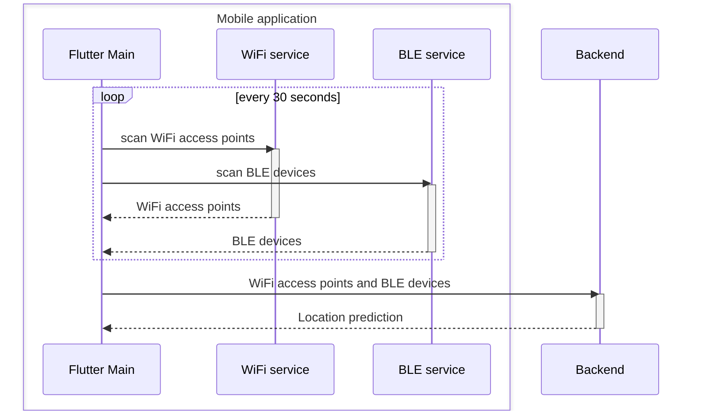

```mermaid
sequenceDiagram
    box Mobile application
    participant main as Flutter Main
    participant wifi as WiFi service
    participant ble as BLE service
    end
    participant be as Backend
    loop every 30 seconds
        main->>wifi: scan WiFi access points
        activate wifi
        main->>ble: scan BLE devices
        activate ble
        wifi-->>main: WiFi access points
        deactivate wifi

        ble-->>main: BLE devices
        deactivate ble
    end

    main->>be: WiFi access points and BLE devices
    activate be
    be-->>main: Location prediction
    deactivate be
```
