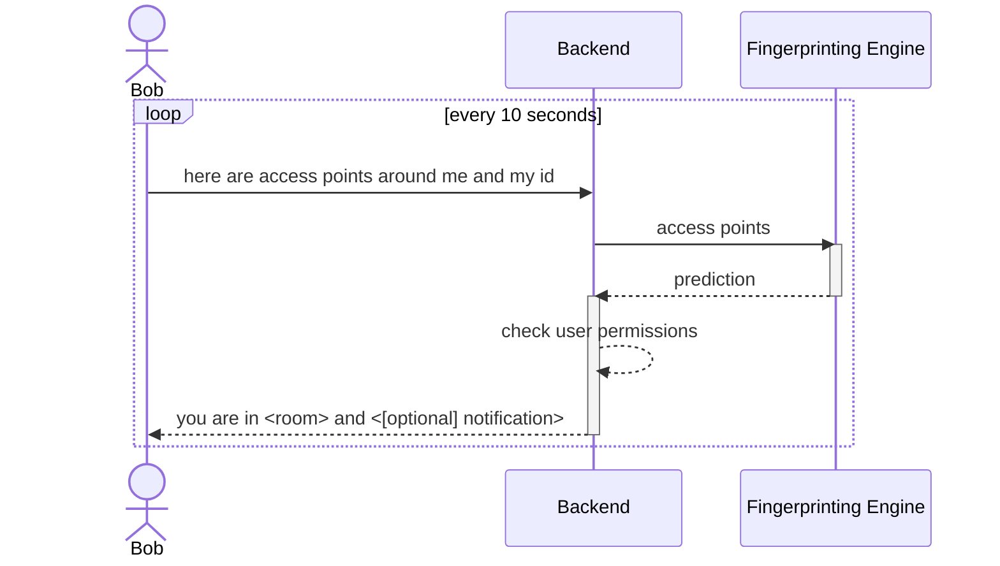

```mermaid

sequenceDiagram
    actor u as Bob
    participant be as Backend
    participant finger as Fingerprinting Engine
    loop every 10 seconds
        u->>be: here are access points around me and my id
        be->>finger: access points
        activate finger
        finger-->>be: prediction
        deactivate finger

        activate be
        be-->>be: check user permissions
        be-->>u: you are in <room> and <[optional] notification>
        deactivate be
    end

```
