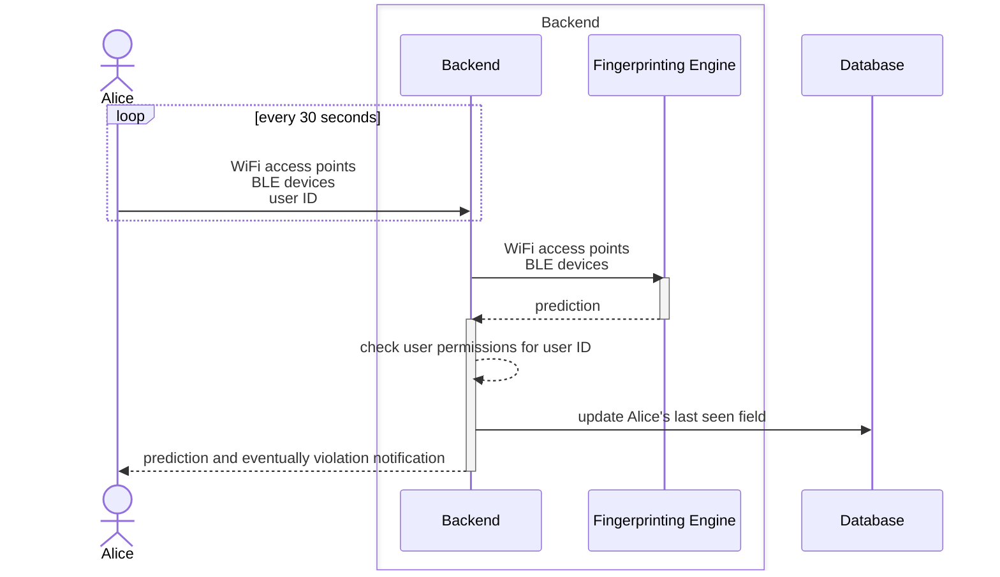

```mermaid
sequenceDiagram
    actor u as Alice
    box Backend
    participant be as Backend
    participant finger as Fingerprinting Engine
    end
    participant db as Database
    loop every 30 seconds
        u->>be: WiFi access points <br> BLE devices <br> user ID
    end
    be->>finger: WiFi access points <br> BLE devices
    activate finger
    finger-->>be: prediction
    deactivate finger

    activate be
    be-->>be: check user permissions for user ID
    be->>db: update Alice's last seen field
    be-->>u: prediction and eventually violation notification
    deactivate be
```
