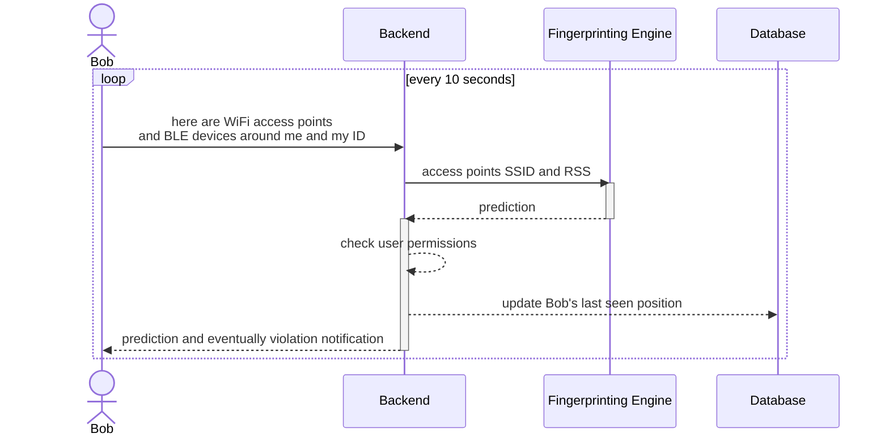

```mermaid

sequenceDiagram
    actor u as Bob
    participant be as Backend
    participant finger as Fingerprinting Engine
    participant db as Database
    loop every 10 seconds
        u->>be: here are WiFi access points <br> and BLE devices around me and my ID
        be->>finger: access points SSID and RSS
        activate finger
        finger-->>be: prediction
        deactivate finger

        activate be
        be-->>be: check user permissions
        be-->>db: update Bob's last seen position
        be-->>u: prediction and eventually violation notification
        deactivate be
    end

```
