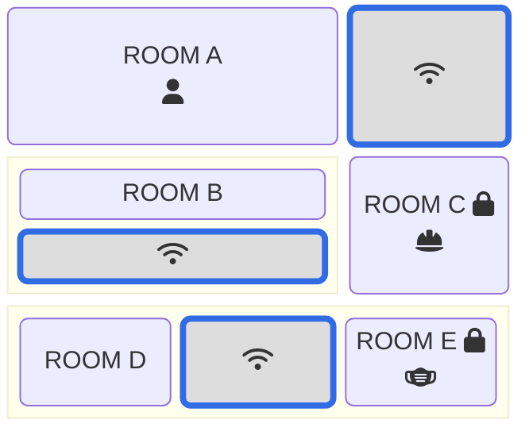

```mermaid
block-beta
  columns 3
  a("ROOM A \n fa:fa-user"):2 ap1("fa:fa-wifi")
  block:group1:2
    columns 1
    b("ROOM B") ap2("fa:fa-wifi")
  end
  c("ROOM C fa:fa-lock \n fa:fa-helmet-safety")
  block:group2:3
    columns 5
    d("ROOM D") ap3("fa:fa-wifi") e("ROOM E fa:fa-lock \n fa:fa-mask-face")
  end

classDef plain fill:#ddd,stroke:#326ce5,stroke-width:4px,color:#000;
classDef k8s fill:#326ce5,stroke:#fff,stroke-width:4px,color:#fff;
class ap1,ap2,ap3 plain
```
